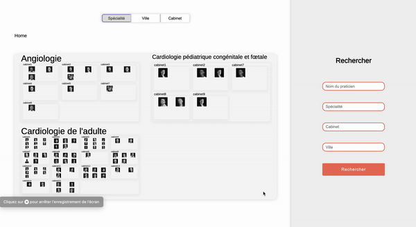
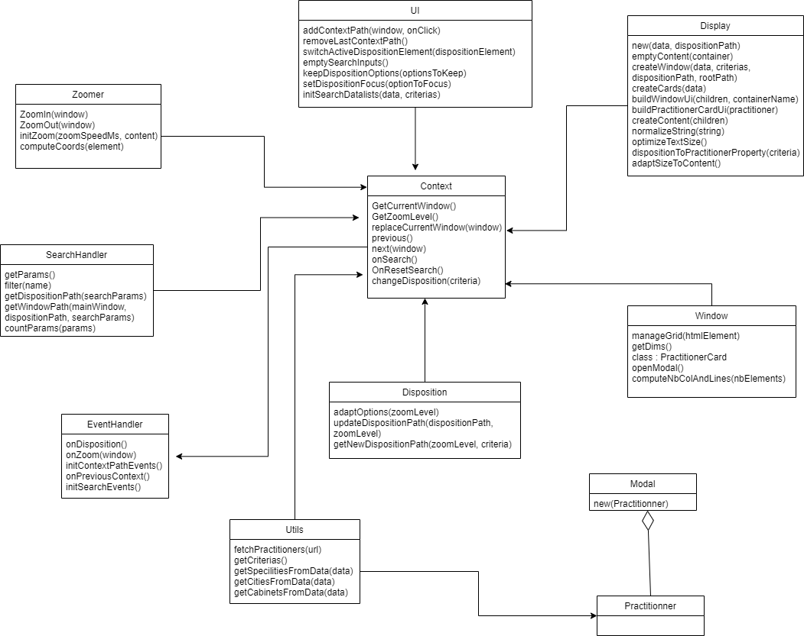

# Trombinoscope

An original, very graphic way to represent the co-workers of an organization.
  

  
## Getting Started

The project is only composed of static files, to bring modifications you will only need a browser.
To compile the final WordPress template (in php), or to run the test, you will need a valid version of `npm` and then run the command `npm install` in the root folder of the repository. It will install automatically all the dependencies needed for the project.

## Generating the final WordPress Template
  
You will first need to execute the 2 following actions before being able to generate the WordPress Template:
  
1. Remove/comment the following lines in the [index.html](./src/index.html) file.

Find the following line in the trombinoscope...
```html
<link rel="stylesheet" href="index.css">
<script type="module" src="./index.js"></script>
```

...and comment them with the following format.
```html
<!-- <link rel="stylesheet" href="index.css">
    <script type="module" src="./index.js"></script> -->
```

2. Use the `production` configuration file instead of the `development`one.

In the [index.js](./src/index.js) file, replace the path used to import the configuration file:

From:
```javascript
import { config } from "./js/config/config.dev.js";
```

To:
```javascript
import { config } from "./js/config/config.prod.js";
```

You can now run the command `npm run build` to create the final WordPress Template. In the `/dist` folder you will find four files:
- [index.html](./dist/index.html)
- [main.bundle.js](./dist/main.bundle.js)
- [main.css](./dist/main.css)
- [trombinoscope.php](./dist/template.php)

To import your modifications in the WordPress template, you will finally have to replace the [trombinoscope.php](./dist/template.php) file in the WordPress source files of your project: at path `wordpress/wp-content/themes/{theme_name}/templates`.
To access to the source files of the WordPress website, you have to access to its server through FTP. Please go to the OVH's administration page for further information. 

## Testing

All the test files are located in the [/test](./test) folder and their names are respecting the [name].test.js naming convention.
To execute the tests, just run the following command: `npm run test`.

## File Organization

[root]  
 +- assets  
 |&nbsp;&nbsp;&nbsp;&nbsp;+- doc  
 |&nbsp;&nbsp;&nbsp;&nbsp;+- practiciens  
 +- dist  
 +- scripts  
 +- src  
 |&nbsp;&nbsp;&nbsp;&nbsp;+- js  
 |&nbsp;&nbsp;&nbsp;&nbsp;&nbsp;&nbsp;&nbsp;&nbsp;+- config  
 |&nbsp;&nbsp;&nbsp;&nbsp;&nbsp;&nbsp;&nbsp;&nbsp;+- lib  
 +- test  

### /assets

Contains all the medias (pictures, gif, etc.) of the application.

#### /assets/doc

Contains the medias displayed in this documentation file.

#### /assets/practictioners

Contains the pictures of most of the practitioners, just in case the pictures stored in WordPress are lost.

### /dist

Contains all the automatically generated files. To generate those files just run the command just follow the instructions mentionned in the *Generating the final WordPress Template* section of this document.

### /scripts

Contains all the external scripts needed for the application:
- [ggSheetScript.js](./scripts/ggSheetScript.js): A copy of this script is executed on a **Google Script App** to provide the REST API for accessing the practitioner's data.
- [templateGenerator.js](./scripts/templateGenerator.js): This script is used to generate the **template.php** file.

### /src

Contains all the source files, which are mainly javascript files. Please go to the *How does it works* section for further information.

### /test

Contains all the test files. Please go to the *Testing* section for further information.

## How does it works

Before starting to understand the code you first need to understand few things:

The tool is organized in four diferent parts:
- **The Ariane's thread**: At the top left corner of the window.
It shows where you are in the application. You can go back on one of the previous steps saved in the path by clicking on the corresponding item.
- **The disposition option**: At the top right corner of the window.
It shows how you can organize the practitioners:
  - If you are at the `Home` position, you can order the pratitioners by speciality, city, cabinet or keeping them unordered.
  - If you are at the `Home > {speciality}` position, you can order the practitioners by cabinet, city or keeping them unordered.
  - If you are at the `Home > {cabinet}` position, you can order the practitioners by speciality or keeping them unordered.
  - If you are at the `Home > {cabinet} > {speciality}` position, you can keep the practitioners unordered
  - etc.
- **The search bar**: At the right of the window.
It enables the user to search for a specific(s) criteria. If the *name field* is filled, the practitioner's list will be updated according to its value, and if its not the user will only be directed to the corresponding window. 
For example, if the user filled the `speciality` and the `cabinet` fields, then the user will be directed to the corresponding `home ᐅ {specialisty} ᐅ {cabinet}` window without filtering the practitioner's list. If the user filled the `name` and the `cabinet` fields, then the user will be directed to the corresponding `home ᐅ {cabinet}` window and the practitioner's list will be filtered according to the name field's value. 
- **The map window**: At the center of the window.
It is the main element of this application. All the other parts are used to organize/manipulate this final element. This element is composed of windows and overview elements depending of the *disposition path* parameter:
- Each window element contains **one** overview element.
- Each overview element contains one or multiple sub-window elements.
- A window can also contain a title.

The following example roughly represents it:
```html
<div class="window">
  <p class="window-title">Home window</p>
  <div class="overview">
    <div class="window">
      ...
    </div>
    <div class="window">
      ...
    </div>
    <div class="window">
      ...
    </div>
  </div>
</div>
```

### Fetching the data

At first the data is loaded from a Google Sheet accessible from the administrator account at the following address `trombi.intranet@gmail.com`. A script placed in [Google Script App](https://script.google.com/) cluster is executed to fetch the data from the Google Sheet to the application. You can find a copy of this script [here](./scripts/ggSheetScript.js).
The `fetchPractitioner` function responsible of fetching the data and parsing each element of the fetched array into [Practitioner](./src/js/Practitioner.js) object is located in [Utils](./src/js/Utils.js) static object.

### Building the display

When the practitioner's data is loaded, the display of these practitioners can be built. The [Display](./src/js/Display.js) object is responsible of recursively creating the [Windows](./src/js/Window.js) and sub-windows objects according to the disposition path and the practitioner's data.
For example if the disposition path is ["`speciality`", "`cabinet`"], the Display object will at first create windows according to the speciality of the pracititioners, and then each of these windows will contain sub-windows according the the cabinets of the practitioners. At the end, when there is no other elements in the disposition path to process, the Display object create a [PractitionerCard](./src/js/Window.js) object for each of the organized practioner.

### The UI events

Multiple UI events can occur on the application:
- **Context events**: When the user clicks on an element of the Ariane's thread. Zoom out until the main window is corresponding to the clicked path element. This zoom action is triggered from the [Context](./src/js/Context.js) object and executed by the [Zoomer](./src/js/Zoomer.js) object.
- **Disposition events**: When the user clicks on a disposition button. Change the current disposition of the practitioners. For example if the user clicks on the `disposition` cabinet, the practioners will be reorganized according to their cabinets. The [Disposition](./src/js/Disposition.js) object takes care of finding the right disposition path according to the clicked button, the current disposition path and the zoom level.
- **Search events**: Start a new search on submitting or clicking on the search button. The [SearchHandler](./src/js/SearchHandler.js) object is used to find the right search options (filtered data, new disposition  and window path, etc.) and the [Context](./src/js/Context.js) object is used to supervise all the search actions. If the data had been filtered from a search by name, it is possible to restore the full practitioner's data by clicking on the "Annuler la recherche" button that appeared.
- **Zoom events**: When the user clicks on a window, a zoom action is triggered from the [Context](./src/js/Context.js) object and executed by the [Zoomer](./src/js/Zoomer.js) object.

All these events are managed in the [EventHandler] object, which is responsible of triggering the right context action for each event.

### UML Diagram



## External Libraries

3 external libraries are used for this project:

- [FitText](https://github.com/adactio/FitText.js): Handles the auto resizing of the texts to fit in their containers.
- [Zinga Scroller](https://github.com/doctyper/zynga-scroller): Simplified the zoom implementation.
- [Tingle](https://github.com/deathbeds/tingle): Simplified the modal implementation, used for the practitioner card.
