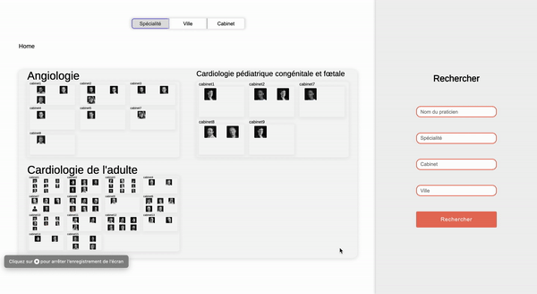

# Trombinoscope
  

  
## Getting Started

The project is only static files, to bring modifications you will only need a browser.
To compile the final wordpress template, or to run the test, you will need a valid version of `npm` and then run the command `npm install` in the root of the folder. It will install all the dependencies needed for the project.

## Generating the final WordPress Template
  
You will first need to execute the 2 following actions before being able to generate:
  
1. Remove/comment the following line in the [index.html](./src/index.html) file

Find the following line in the trombinoscope...
```html
<link rel="stylesheet" href="index.css">
<script type="module" src="./index.js"></script>
```

...and comment it with the following format
```html
<!-- <link rel="stylesheet" href="index.css">
    <script type="module" src="./index.js"></script> -->
```

2. Use the `production` configuration file

In the [index.js](./src/index.js) file, replace the path used to import the configuration file:

From:
```javascript
import { config } from "./js/config/config.dev.js";
```

To:
```javascript
import { config } from "./js/config/config.prod.js";
```

You can now run the command `npm run build` to create the final WordPress Template. In the `/dist` folder you will find four files:
- [index.html](./dist/index.html)
- [main.bundle.js](./dist/main.bundle.js)
- [main.css](./dist/main.css)
- [trombinoscope.php](./dist/template.php)

To import your modifications in the WordPress template, you will finally have to replace the [trombinoscope.php](./dist/template.php) file in the WordPress source files of your project: at path `wordpress/wp-content/themes/{theme_name}/templates`.

## How does it works

Before starting to understand the code you first need to understand few things:

The tool is organized in four diferent parts:
- **The Ariane's thread**: at the top left corner
It shows where you are in the application. You can go back on one of the previous step of the path by clicking on the corresponding item 
- **The disposition option**: at the top right corner
It shows how you can organize the practitioners:
  - if you are at the `Home` position, you can order the pratitioners by speciality, city, cabinet or keeping them unordered
  - if you are at the `Home > {speciality}` position, you can order the practitioners by cabinet, city or keeping them unordered
  - if you are at the `Home > {cabinet}` position, you can order the practitioners by speciality or keeping them unordered
  - if you are at the `Home > {cabinet} > {speciality}` position, you can keep the practitioners unordered
  - etc.
- **The search bar**: at the right of the window
It enables the user to search for a specific(s) criteria. If the name field is filled, the practitioners list will be updated according to its value, and if its not the user will only be directed to the corresponding window. 
For example, if the user filled the `speciality` and the `cabinet` fields, the user will then be directed to the corresponding `home ᐅ {specialisty} ᐅ {cabinet}` window.
- **The map window**: at the center of the window
It is the main element of this application. All the other parts are used organize/manipulate this final element. This element is composed of windows and overview elements depending of the disposition parameter:
Each window element contains **one** overview element.
Each overview element contains one or multiple sub-window elements
A window can also contain a title

The following example roughly represents it:
```html
<div class="window">
  <p class="window-title">Home window</p>
  <div class="overview">
    <div class="window">
      ...
    </div>
    <div class="window">
      ...
    </div>
    <div class="window">
      ...
    </div>
  </div>
</div>
```

### Fetching the data

At first the data is loaded from a Google Sheet accessible from the administrator account at the following address `trombi.intranet@gmail.com`. Once 
### Building the display

The 
### Initialize the events

### 
## External Libraries

3 external libraries are used for this project:

- [FitText](https://github.com/adactio/FitText.js): Handles the auto resizing of the texts to fit in their containers
- [Zinga Scroller](https://github.com/doctyper/zynga-scroller): Simplified the zoom implementation
- [Tingle](https://github.com/deathbeds/tingle): Simplified the modal implementation, used for the practitioner card
